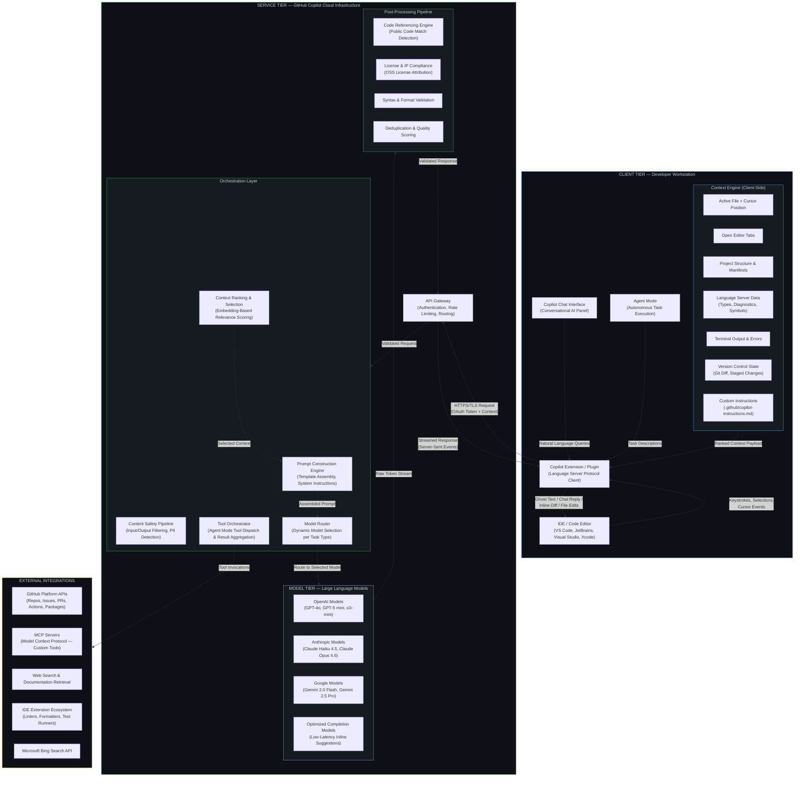
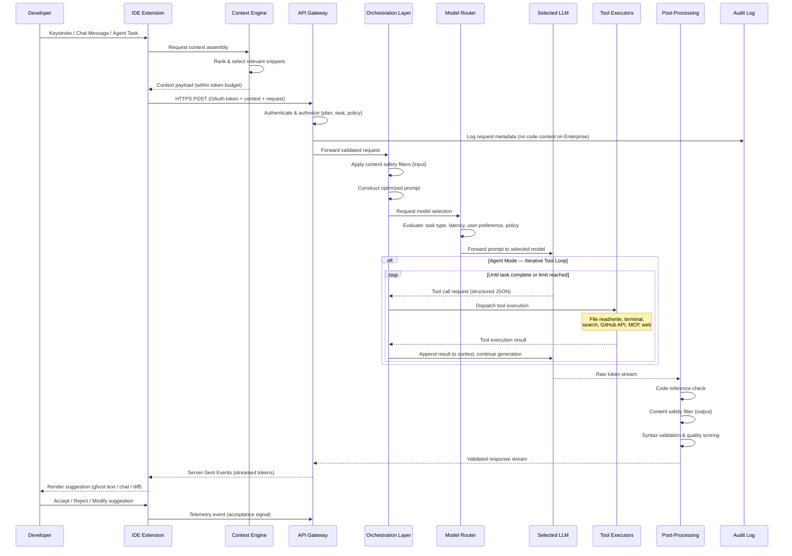

# GitHub Copilot — Enterprise Architecture Reference

**Version:** 1.1  
**Date:** March 17, 2026  
**Audience:** Enterprise Architects, Engineering Leadership, Security & Compliance Teams  
**Classification:** Internal / Shareable

---

## Table of Contents

1. [Executive Summary](#1-executive-summary)
2. [Architectural Overview](#2-architectural-overview)
3. [Component Architecture](#3-component-architecture)
4. [Request Lifecycle & Data Flow](#4-request-lifecycle--data-flow)
5. [Interaction Modalities](#5-interaction-modalities)
6. [Agentic Architecture — Agent Mode & Tool Use](#6-agentic-architecture--agent-mode--tool-use)
7. [Model Strategy & Multi-Model Architecture](#7-model-strategy--multi-model-architecture)
8. [Security, Privacy & Compliance](#8-security-privacy--compliance)
9. [Enterprise Governance & Policy Controls](#9-enterprise-governance--policy-controls)
10. [Extensibility Architecture — MCP, Custom Agents & Instructions](#10-extensibility-architecture--mcp-custom-agents--instructions)
11. [Network Architecture & Connectivity](#11-network-architecture--connectivity)
12. [Deployment Topology & IDE Support Matrix](#12-deployment-topology--ide-support-matrix)
13. [Licensing & Plan Comparison](#13-licensing--plan-comparison)
14. [Key Differentiators vs. Direct LLM API Integration](#14-key-differentiators-vs-direct-llm-api-integration)
15. [Architectural Considerations for Enterprise Adoption](#15-architectural-considerations-for-enterprise-adoption)
16. [Official References](#16-official-references)

---

## 1. Executive Summary

GitHub Copilot is an AI-powered software development platform that integrates large language models (LLMs) directly into the developer workflow through IDE extensions, CLI tooling, and GitHub.com native experiences [¹⁴](#ref-14). It operates as a **managed, multi-model orchestration service** — abstracting model selection, prompt engineering, context retrieval, content safety, and intellectual property compliance from the developer.

At the architectural level, Copilot comprises three principal tiers:

- **Client tier** — IDE extensions (VS Code, JetBrains, Visual Studio, Xcode, Eclipse) that capture development context and render AI-generated suggestions.
- **Service tier** — GitHub-hosted cloud infrastructure responsible for authentication, prompt construction, context ranking, model routing, content filtering, and post-processing.
- **Model tier** — Multiple LLMs from OpenAI, Anthropic, and Google, selected dynamically based on task characteristics (latency requirements, reasoning complexity, context window needs).

For enterprise organizations, Copilot provides centralized policy management, audit logging, IP indemnity, and data residency controls through the **GitHub Copilot Business** and **GitHub Copilot Enterprise** plans. Individual developers can choose from **Free**, **Pro** ($10/month), and **Pro+** ($39/month) tiers. Code snippets processed by the service are **not retained or used for model training** on Business and Enterprise plans [¹](#ref-1).

---

## 2. Architectural Overview

### 2.1 High-Level Architecture Diagram



### 2.2 Architectural Principles

| Principle | Implementation |
|---|---|
| **Multi-model abstraction** | Developers interact with a unified interface; model selection is handled by the service based on task type, latency requirements, and organizational policy |
| **Context-first design** | Suggestion quality is driven by context relevance; the context engine and ranking system are as critical as the models themselves |
| **Zero-retention data handling** | On Business/Enterprise plans, prompts and suggestions are not stored after processing and are not used for model training [¹](#ref-1) |
| **Defense in depth** | Content filtering occurs at both input (prompt) and output (response) stages; code referencing provides IP compliance |
| **Progressive capability** | Four interaction modalities (completions → chat → agent → coding agent) allow incremental adoption with increasing autonomy |
| **Extensible by design** | Model Context Protocol (MCP), custom instructions, and the VS Code extension API enable organization-specific customization |

---

## 3. Component Architecture

### 3.1 Client Tier — IDE Extension

The Copilot extension runs as a **client-side process** within the IDE. It is responsible for context capture, request lifecycle management, and rendering of AI-generated suggestions.

| Component | Responsibility | Technical Detail |
|---|---|---|
| **Extension Runtime** | Lifecycle management, activation, configuration | Runs as a VS Code extension (TypeScript), JetBrains plugin (Kotlin/Java), or Visual Studio extension (C#). Communicates via the Language Server Protocol (LSP) internally [²](#ref-2). |
| **Context Engine** | Aggregates development context from multiple IDE sources | Collects data from: active editor buffer, open tabs, file system structure, language server (types, symbols, diagnostics), terminal output, git state. Applies client-side relevance heuristics before transmission. |
| **Inline Completion Provider** | Renders ghost text suggestions in the editor | Implements the IDE's inline completion API. Manages debouncing (typically 50–150ms after keystroke), cancellation of in-flight requests, and suggestion caching. |
| **Chat Provider** | Manages conversational interactions | Handles multi-turn conversation state, code selection attachment, slash commands (`/explain`, `/tests`, `/fix`), and participant routing (`@workspace`, `@terminal`). |
| **Agent Runtime** | Executes autonomous multi-step workflows | Implements the tool-use loop: receives tool call requests from the model, executes them locally (file reads, edits, terminal commands, searches), and returns results to the service. Manages user approval flows for destructive operations. |
| **Authentication Module** | Manages OAuth flow and token lifecycle | Authenticates via GitHub OAuth 2.0. Stores tokens securely using the IDE's secret storage API. Handles token refresh and re-authentication. |

#### 3.1.1 Context Gathering — Detailed Breakdown

The quality of Copilot's suggestions is fundamentally determined by the **relevance of context** sent with each request. The context engine assembles the following:

| Context Source | Data Captured | Relevance Signal |
|---|---|---|
| **Active file** | Full file content with cursor position marked | Primary — the immediate editing context |
| **Open editor tabs** | Content of other open files | High — developer explicitly opened these files, suggesting relevance |
| **Imported/referenced files** | Files connected via `import`, `require`, `#include`, or language-specific resolution | High — type definitions, interface contracts, related modules |
| **Project manifest** | `package.json`, `pyproject.toml`, `go.mod`, `.csproj`, `pom.xml` | Medium — signals language, framework, and dependency versions |
| **Directory structure** | Folder hierarchy and file names | Medium — signals architectural patterns and naming conventions |
| **Language server data** | Type information, symbol definitions, diagnostics, hover data | High — enables type-aware completions |
| **Terminal output** | Recent terminal/console output including error messages | Situational — critical when fixing build or test failures |
| **Git state** | Uncommitted changes (diff), recent commit messages | Medium — signals current task and intent |
| **Custom instructions** | `.github/copilot-instructions.md` and instruction files | Policy — organizational coding standards and conventions |
| **Conversation history** | Previous messages in chat/agent sessions | Continuity — maintains multi-turn coherence |

The context engine applies **embedding-based relevance scoring** to rank and select the most pertinent snippets, as the aggregate context typically exceeds the model's context window capacity. GitHub has published research on this ranking approach in their engineering blog [³](#ref-3).

---

### 3.2 Service Tier — GitHub Copilot Cloud Infrastructure

The service tier is a **managed cloud service** operated by GitHub. It is not self-hostable. All processing occurs within GitHub's infrastructure and, for Azure OpenAI-backed models, within Microsoft Azure data centers.

| Component | Responsibility | Enterprise Relevance |
|---|---|---|
| **API Gateway** | Request authentication, rate limiting, plan entitlement validation, geographic routing | Validates GitHub OAuth tokens. Enforces per-seat and per-organization rate limits. Routes to appropriate regional endpoints. |
| **Prompt Construction Engine** | Assembles the final prompt sent to the LLM | Combines system instructions (Copilot's behavioral rules), ranked context snippets, user code/query, and formatting directives into an optimized prompt structure. This is proprietary logic — developers do not write or see the full prompt. |
| **Context Ranking Service** | Selects the most relevant context within token budget | Uses embedding models to score context relevance. Implements a token-budget allocation strategy: high-priority context (active file, selected code) gets guaranteed allocation; remaining budget is distributed by relevance score. |
| **Model Router** | Selects the appropriate model for each request | Routes based on: request type (completion vs. chat vs. agent), user's model selection preference, latency requirements, and model availability. Implements fallback routing if a model is degraded. |
| **Tool Orchestrator** | Dispatches and manages tool calls in Agent Mode | Receives structured tool call requests from the model, routes them to the appropriate executor (client-side for file/terminal operations, server-side for GitHub API/web search), aggregates results, and feeds them back into the model's context for the next reasoning step. |
| **Content Safety Pipeline** | Filters inputs and outputs for policy compliance | Multi-stage filtering: (1) input screening for prompt injection and abuse, (2) output screening for harmful content, (3) PII detection, (4) organizational policy enforcement (e.g., blocking suggestions in certain file types). |
| **Code Referencing Engine** | Detects matches against public code repositories | Compares generated suggestions against a searchable index of public code. When a match is detected, provides the source URL and license information. Organizations can configure this to block matching suggestions entirely [⁴](#ref-4). |

---

### 3.3 Model Tier — Multi-Model Architecture

GitHub Copilot employs a **multi-model strategy** where different models are selected based on the task characteristics. This is a key architectural differentiator — the developer interacts with a unified interface while the platform optimizes model selection behind the scenes.

| Model Provider | Models Available | Primary Use Cases | Characteristics |
|---|---|---|---|
| **OpenAI** | GPT-4o, GPT-5 mini, o3-mini | Default for completions, chat, agent mode | Broad code generation capability; GPT-5 mini is the default unlimited model on Pro tier |
| **Anthropic** | Claude Haiku 4.5, Claude Opus 4.6 | Default free-tier model (Haiku); premium reasoning (Opus) | Strong reasoning, detailed explanations, large context window. Opus 4.6 available on Pro+ |
| **Google** | Gemini 2.0 Flash, Gemini 2.5 Pro | User-selectable for chat and agent mode | Fast inference (Flash), strong multimodal capability (Pro) |
| **Optimized completion models** | Specialized smaller models | Inline ghost text completions | Tuned for low latency (200–500ms); optimized for code completion specifically |

#### 3.3.1 Model Selection Logic

```
Request Type → Model Selection:

Inline Completion    →  Fast completion model (latency-optimized, <500ms target)
Next Edit Suggestion →  Predictive model (suggests next likely edit location)
Chat (default)       →  GPT-5 mini (unlimited on Pro) or user-selected model
Chat (user override) →  Claude / Gemini / GPT-4o (user selects in UI)
Agent Mode (IDE)     →  Most capable available model (Claude Opus 4.6, GPT-4o)
Coding Agent (GitHub)→  Assigned via GitHub Issues; runs autonomously on GitHub infra
Code Review          →  GPT-4o or organizational default
PR Summarization     →  GitHub.com native feature (model selected by GitHub)
```

Enterprise administrators can configure **model policies** to restrict which models are available to their organization, ensuring compliance with approved vendor lists [⁵](#ref-5).

---

### 3.4 Post-Processing Pipeline

All model outputs pass through a **multi-stage post-processing pipeline** before delivery to the client.

| Stage | Function | Enterprise Impact |
|---|---|---|
| **Code Referencing** | Detects if the suggestion substantially matches code in public repositories. Returns source URL and license metadata when a match is found. | Configurable: `block` (reject matching suggestions), `allow` (show with attribution). Critical for IP compliance and license risk mitigation [⁴](#ref-4). |
| **Content Safety Filter** | Scans output for harmful, offensive, or policy-violating content | Applies Microsoft's Responsible AI content filtering framework. |
| **Duplication & Quality Filter** | Removes repetitive, trivial, or low-confidence suggestions | Prevents suggestion fatigue; maintains developer trust in suggestion quality. |
| **Syntax Validation** | Verifies structural correctness for the target language | Reduces obviously broken suggestions (unmatched brackets, invalid syntax). |

---

## 4. Request Lifecycle & Data Flow

### 4.1 Sequence Diagram



### 4.2 Request Lifecycle — Detailed Walkthrough

| Phase | Description | Latency Budget |
|---|---|---|
| **1. Event Detection** | Extension detects a trigger event: keystroke pause (completions), message submit (chat), or task start (agent). Debounce logic prevents excessive requests. | 50–150ms (client-side debounce) |
| **2. Context Assembly** | Context engine gathers data from IDE sources: active file, open tabs, language server, terminal, git state, custom instructions. Applies relevance ranking within the model's token budget. | 10–50ms (local) |
| **3. Request Transmission** | HTTPS POST to the Copilot API gateway with OAuth bearer token, context payload, and request metadata (language, IDE version, request type). | Network-dependent |
| **4. Authentication & Policy** | Gateway validates the OAuth token against the user's GitHub account, verifies Copilot seat assignment and plan entitlements, and applies organizational policies (content exclusions, model restrictions). | <50ms |
| **5. Input Safety Screening** | Content safety pipeline scans the prompt for potential abuse, prompt injection attempts, or policy violations. | <20ms |
| **6. Prompt Construction** | The orchestration layer assembles the final prompt: system instructions + organizational custom instructions + ranked context + user query/code. The prompt template is engineered by GitHub and is not exposed to end users. | <10ms |
| **7. Model Inference** | The assembled prompt is sent to the selected LLM. The model generates tokens autoregressively. For agent mode, the model may emit tool call tokens instead of text. | 200ms–30s (varies by model and task) |
| **8. Tool Execution (Agent Mode only)** | If the model requests a tool call, the orchestrator dispatches the request — to the client (file operations, terminal) or server-side (GitHub API, web search). Results are appended to the context, and the model continues generation. This loop repeats until the task is complete or a safety limit is reached. | Per-tool: 100ms–10s |
| **9. Post-Processing** | The raw model output passes through code referencing, content safety filtering, duplication detection, and syntax validation. | <100ms |
| **10. Response Delivery** | Validated tokens are streamed to the client via Server-Sent Events (SSE). The extension renders them as ghost text (completions), chat messages, or file diffs (agent mode). | Streaming — first token in <500ms for completions |
| **11. Telemetry** | On suggestion acceptance or rejection, the extension sends an anonymized telemetry event to improve ranking and suggestion quality. No code content is included in telemetry on Business/Enterprise plans. | Async, non-blocking |

---

## 5. Interaction Modalities

GitHub Copilot provides four distinct interaction modalities, each with different architectural characteristics and increasing levels of autonomy:

### 5.1 Inline Code Completions

| Attribute | Detail |
|---|---|
| **Trigger** | Keystroke pause (debounced, typically 50–150ms) |
| **Model** | Optimized low-latency completion model |
| **Target latency** | 200–500ms end-to-end |
| **Context scope** | Active file, open tabs, imports, language server types |
| **Output** | 1–15 lines of code rendered as gray "ghost text" in the editor |
| **User action** | Tab to accept, Esc to dismiss, continue typing to refine |
| **Architectural note** | Uses a smaller, faster model specifically tuned for code completion. Latency is the primary optimization target — every millisecond matters for developer flow state. Requests are **fire-and-forget with cancellation**: if the developer types another character before the response arrives, the in-flight request is cancelled and a new one is issued. |

### 5.1.1 Next Edit Suggestions (NES)

| Attribute | Detail |
|---|---|
| **Trigger** | Automatically predicted after a code edit; suggests the *next location* and edit |
| **Availability** | VS Code, Xcode, Eclipse (public preview) |
| **Output** | Predicts where the developer will edit next and proposes the change |
| **Architectural note** | NES goes beyond standard inline completions by predicting *intent continuity* — if you rename a variable in one place, NES may suggest renaming it in the next usage. This requires tracking edit history and applying pattern recognition across the session. |

### 5.2 Copilot Chat

| Attribute | Detail |
|---|---|
| **Trigger** | Developer submits a message in the chat panel |
| **Model** | Full-capability model (GPT-4o, Claude, Gemini — user-selectable) |
| **Target latency** | First token in 1–3s; full response streamed over 2–15s |
| **Context scope** | Selected code, open files, conversation history, `@workspace` indexed files, custom instructions |
| **Output** | Natural language explanations, code blocks, terminal commands, file references |
| **Participants** | Chat supports **participants** that specialize context: `@workspace` (codebase-wide search), `@terminal` (terminal context), `@github` (GitHub issues/PRs/repos) |
| **Slash commands** | `/explain`, `/tests`, `/fix`, `/doc`, `/new` — pre-built prompt templates for common tasks |
| **Architectural note** | Chat maintains **multi-turn conversation state**. Each message in a turn includes the full conversation history (within token limits) plus newly gathered context. The participant system enables routing to specialized context providers without the developer manually attaching files. |

### 5.3 Agent Mode (IDE-Based Autonomous Editing)

| Attribute | Detail |
|---|---|
| **Trigger** | Developer describes a high-level task in the IDE chat panel (agent mode) |
| **Model** | Most capable available model (Claude Opus 4.6, GPT-4o) |
| **Duration** | 30 seconds to several minutes per task |
| **Context scope** | Full workspace (searched on-demand), terminal, GitHub APIs, web, MCP tools |
| **Output** | Multi-file edits, new file creation, terminal command execution, iterative refinement |
| **Approval model** | Destructive operations (file deletion, terminal commands) require explicit developer approval |
| **Iteration** | The agent runs in a **tool-use loop** — it reasons, calls tools, observes results, and continues until the task is complete or a safety limit is reached |
| **IDE availability** | VS Code, Visual Studio, and JetBrains IDEs (not yet available in Xcode or Eclipse) |
| **Architectural note** | Agent mode is architecturally distinct from completions and chat. It implements a **ReAct-style reasoning loop** [⁶](#ref-6) where the model alternates between reasoning steps and tool actions. The tool orchestrator manages the dispatch of tool calls to appropriate executors (client-side for file I/O and terminal; server-side for GitHub API and web search). Session state is maintained across the loop iterations. |

### 5.4 Copilot Coding Agent (GitHub-Native Autonomous Agent)

Distinct from IDE Agent Mode, the **Copilot Coding Agent** operates entirely on GitHub's infrastructure:

| Attribute | Detail |
|---|---|
| **Trigger** | Assign a GitHub issue to Copilot (or request from Copilot Chat on GitHub.com) |
| **Execution** | Runs autonomously on GitHub-hosted infrastructure — no IDE required |
| **Output** | Creates a pull request with code changes, responds to PR review feedback |
| **Third-party agents** | Supports third-party coding agents (Claude by Anthropic, OpenAI Codex) assignable alongside Copilot |
| **Workflow** | Reads issue description → analyzes repository → implements changes → creates PR → iterates on reviewer feedback |
| **Architectural note** | This is a separate execution environment from IDE agent mode. The agent runs in a secure cloud sandbox with access to the repository contents, and creates commits on a dedicated branch. It does not execute on the developer's local machine. |

---

## 6. Agentic Architecture — Agent Mode & Tool Use

### 6.1 The Agentic Loop

Agent Mode implements an iterative **Reasoning + Action (ReAct)** pattern:

```
┌──────────────────────────────────────────────────────────────┐
│                                                              │
│  1. TASK INTAKE     Developer describes a goal               │
│         ↓                                                    │
│  2. PLANNING        Model analyzes task, determines approach │
│         ↓                                                    │
│  3. TOOL SELECTION  Model selects appropriate tool           │
│         ↓                                                    │
│  4. TOOL EXECUTION  Orchestrator dispatches tool call        │
│         ↓                                                    │
│  5. OBSERVATION     Model receives and interprets result     │
│         ↓                                                    │
│  6. EVALUATION      Is the task complete?                    │
│         ↓               ↓                                    │
│       YES → DONE      NO → Go to step 3                     │
│                                                              │
│  Safety: Max iterations enforced; destructive ops need       │
│          developer approval; timeout limits applied          │
│                                                              │
└──────────────────────────────────────────────────────────────┘
```

### 6.2 Tool Taxonomy

| Tool Category | Tools | Execution Location | Approval Required |
|---|---|---|---|
| **File System (Read)** | `read_file`, `list_directory`, `file_search`, `grep_search`, `semantic_search` | Client (IDE) | No |
| **File System (Write)** | `create_file`, `edit_file`, `replace_in_file` | Client (IDE) | No (shown as diff for review) |
| **Terminal** | `run_in_terminal`, `get_terminal_output` | Client (IDE) | Yes — developer must approve commands |
| **Search** | `semantic_search`, `grep_search` | Client (IDE) | No |
| **GitHub Platform** | Issues, PRs, repo metadata, Actions | Server (GitHub API) | Varies by operation |
| **Web** | `fetch_webpage`, web search | Server | No |
| **MCP (Custom)** | Organization-defined tool servers | Client or Server | Configurable per MCP server |

### 6.3 Agent Mode Safety Controls

| Control | Detail |
|---|---|
| **Iteration limit** | Maximum number of tool-call iterations per session to prevent runaway loops |
| **Terminal approval** | All terminal commands require explicit developer approval before execution |
| **File edit review** | All file modifications are shown as diffs in the IDE for developer review |
| **Destructive operation guard** | File deletions, force pushes, and similar destructive operations require explicit confirmation |
| **Content safety** | All tool outputs pass through the content safety pipeline before being fed back to the model |
| **Timeout** | Sessions automatically terminate after a configurable maximum duration |

---

## 7. Model Strategy & Multi-Model Architecture

### 7.1 Architectural Rationale

GitHub Copilot's multi-model strategy is driven by three requirements:

1. **Latency sensitivity** — Inline completions require <500ms end-to-end; chat and agent tasks tolerate several seconds. Different models optimize for different points on the latency/quality curve.
2. **Task specialization** — Code completion, natural language explanation, and multi-step reasoning are fundamentally different tasks. No single model is optimal for all three.
3. **Vendor resilience** — Multi-model support provides redundancy and allows GitHub to route around provider outages or degradations [¹⁵](#ref-15).

### 7.2 Model Routing Architecture

```
┌─────────────────────────────────────────────────────────────┐
│                    Model Router                              │
│                                                              │
│  Inputs:                                                     │
│    • Request type (completion / chat / agent / review)       │
│    • User model preference (if set)                          │
│    • Organization model policy (if configured)               │
│    • Current model availability & latency                    │
│    • Context window requirements                             │
│                                                              │
│  Decision:                                                   │
│    1. Check org policy — is the preferred model allowed?     │
│    2. Check user preference — honor if allowed by policy     │
│    3. Apply task-type defaults:                              │
│       • Completion → fast model                              │
│       • Chat → default large model or user preference        │
│       • Agent → most capable model                           │
│    4. Check availability — fallback to alternate if needed   │
│                                                              │
│  Output: Selected model endpoint + parameters                │
└─────────────────────────────────────────────────────────────┘
```

### 7.3 Enterprise Model Governance

Enterprise administrators can enforce model policies through the GitHub organization settings:

- **Allow/deny specific models** — Restrict which models are available to the organization
- **Set organizational defaults** — Configure the default model for chat and agent mode
- **Audit model usage** — Track which models are being used via audit logs

This ensures that organizations with vendor restrictions (e.g., "only OpenAI models" or "no data to provider X") can enforce compliance at the platform level [⁵](#ref-5).

---

## 8. Security, Privacy & Compliance

### 8.1 Data Handling Architecture

| Data Category | Business/Enterprise Plan | Individual Plan |
|---|---|---|
| **Prompts (code context sent to service)** | Encrypted in transit (TLS 1.2+). Not stored after request processing. Not used for model training. [¹](#ref-1) | Encrypted in transit. May be used to improve the service. |
| **Suggestions (model output)** | Not stored after delivery. Not used for model training. | May be retained for quality improvement. |
| **Telemetry (acceptance/rejection signals)** | Anonymized engagement data collected. No code content. Configurable by organization. | Standard telemetry collected. |
| **Audit logs** | API request metadata logged (no code content). Available via GitHub Audit Log API. [⁷](#ref-7) | Not available. |
| **Chat conversation history** | Retained client-side only (IDE memory). Not persisted server-side after session. | Retained client-side. |

### 8.2 Content Exclusion

Organizations can configure **content exclusion rules** to prevent Copilot from accessing or providing suggestions for specific files or repositories [⁸](#ref-8):

- **Repository-level exclusion** — Exclude entire repositories from Copilot
- **Path-based exclusion** — Exclude specific directories or file patterns (e.g., `**/secrets/**`, `**/*.key`)
- **Organization-wide rules** — Apply exclusions across all repositories in the organization

When a file matches an exclusion rule, Copilot will:
- Not provide inline completions in that file
- Not include that file's content as context for suggestions in other files
- Not read that file in Copilot Chat

> **Important limitation:** Content exclusions are **not currently enforced** in Agent Mode, Copilot Coding Agent, or GitHub Copilot CLI. Organizations should account for this when assessing data exposure risk for sensitive repositories [⁸](#ref-8).

### 8.3 IP Indemnity & Code Referencing

GitHub provides **intellectual property (IP) indemnity** for Copilot Business and Enterprise customers, covering claims that Copilot suggestions infringe third-party IP rights. This indemnity is contingent on having the **code referencing / duplication detection filter** enabled [⁴](#ref-4).

The code referencing system:
- Maintains a searchable index of public code on GitHub
- Compares generated suggestions against this index in real-time
- When a substantial match is found:
  - **Block mode:** The suggestion is suppressed
  - **Allow mode:** The suggestion is shown with source URL and license attribution
- Organizations can choose between block and allow modes via policy settings

### 8.4 Compliance Certifications

GitHub Copilot inherits the compliance posture of the GitHub platform:

- SOC 2 Type II
- ISO 27001
- FedRAMP (GitHub Enterprise Cloud with data residency)
- GDPR compliance with Data Processing Agreement (DPA)
- See the GitHub Copilot Trust Center for the full compliance matrix [⁹](#ref-9)

---

## 9. Enterprise Governance & Policy Controls

### 9.1 Organization-Level Controls

| Control | Scope | Description |
|---|---|---|
| **Seat management** | Organization | Assign and revoke Copilot seats per user. Supports team-based assignment. |
| **Policy: Copilot for IDE** | Organization | Enable/disable Copilot suggestions in IDEs |
| **Policy: Copilot Chat** | Organization | Enable/disable the chat interface |
| **Policy: Agent Mode** | Organization | Enable/disable Agent Mode capabilities |
| **Policy: Model selection** | Organization | Restrict available models to an approved list |
| **Policy: Code referencing** | Organization | Set to `block` or `allow` for public code matches |
| **Policy: Content exclusions** | Organization / Repository | Define paths and repos excluded from Copilot |
| **Policy: MCP servers** | Organization | Allow/deny custom MCP tool servers |
| **Policy: Web search** | Organization | Enable/disable web search capability in chat/agent |
| **Audit logging** | Organization | All Copilot API interactions logged (metadata only) via GitHub Audit Log [⁷](#ref-7) |

### 9.2 Audit Log Schema (Key Fields)

Enterprise administrators can query Copilot activity through the GitHub Audit Log API. The following is an **illustrative representation** of the key fields (consult the official audit log documentation [⁷](#ref-7) for the current schema):

```
{
  "action": "copilot.completion" | "copilot.chat" | "copilot.agent",
  "actor": "<username>",
  "org": "<organization>",
  "created_at": "<ISO 8601 timestamp>",
  "editor": "vscode" | "jetbrains" | "visual_studio",
  "model": "<model identifier>",
  "language": "<programming language>",
  "suggestion_accepted": true | false,
  "repository_visibility": "private" | "internal" | "public"
}
```

Note: **No code content, prompts, or suggestions are included in audit logs.** Only metadata is logged.

---

## 10. Extensibility Architecture — MCP, Custom Agents & Instructions

### 10.1 Model Context Protocol (MCP)

MCP is an **open protocol** (developed by Anthropic [¹⁰](#ref-10)) that allows Copilot to connect to external data sources and tools. It provides a standardized interface for:

| MCP Capability | Description | Example |
|---|---|---|
| **Tools** | Functions that Copilot can invoke during agent sessions | Query an internal database, trigger a CI/CD pipeline, look up internal documentation |
| **Resources** | Data sources that provide additional context | Database schemas, API specifications, configuration registries |
| **Prompts** | Pre-built prompt templates for specific tasks | Organization-specific code review checklist, deployment workflow |

#### MCP Architecture

```
Copilot Agent Mode
    ↓ (tool call via MCP protocol)
MCP Client (built into Copilot)
    ↓ (JSON-RPC over stdio or HTTP/SSE)
MCP Server (organization-hosted)
    ↓ (server's internal logic)
External System (database, API, CI/CD, etc.)
```

MCP servers can be run **locally** (stdio transport, per-developer) or **remotely** (HTTP/SSE transport, shared across teams). Organizations configure allowed MCP servers via VS Code settings or organizational policy.

### 10.2 Custom Instructions

GitHub Copilot supports a hierarchy of instruction files that shape its behavior:

| Instruction Type | File Location | Scope | Use Case |
|---|---|---|---|
| **Repository instructions** | `.github/copilot-instructions.md` | Per-repository | Coding conventions, framework patterns, architectural decisions |
| **Contextual instructions** | Any `.instructions.md` file with YAML frontmatter | Per-directory or per-file-pattern | Language-specific rules, module-specific patterns |
| **User instructions** | VS Code settings | Per-user | Personal preferences, common patterns |
| **Agent definitions** | `.github/agents/*.md` | Per-repository | Custom agent personas with specific tool access and behavioral rules |

This instruction hierarchy enables organizations to codify their coding standards, security requirements, and architectural patterns directly into the AI assistant — ensuring Copilot generates code that **conforms to organizational conventions** without developer intervention.

### 10.3 Copilot Spaces

**Copilot Spaces** allow teams to organize and centralize relevant content — code, docs, specs, and more — into curated spaces that ground Copilot's responses in the right context for a specific task. Spaces serve as shared sources of truth that keep teams consistent and scale knowledge across the organization.

- Create a Space with references to specific files, repositories, documentation
- Copilot uses Space context when answering questions within that scope
- Evolution of the earlier "Knowledge Bases" concept in Copilot Enterprise

### 10.4 Copilot Memory (Public Preview)

Copilot can deduce and store useful information about a repository, which the Copilot Coding Agent and Copilot Code Review can use to improve output quality when working in that repository. Memories are repository-scoped and help the agent learn project-specific conventions over time.

### 10.5 GitHub Copilot Extensions

Third-party extensions can integrate with Copilot via the **Copilot Extensions API** [¹¹](#ref-11):

- Extensions register as **chat participants** (e.g., `@docker`, `@azure`)
- They receive the user's query and context, process it with their domain expertise, and return responses
- Extensions can provide tools for Agent Mode
- Managed through the GitHub Marketplace; installed at the organization level

---

## 11. Network Architecture & Connectivity

### 11.1 Network Flow

```
Developer Workstation
    ↓ HTTPS/TLS 1.2+ (port 443)
    ↓ Endpoint: api.github.com / copilot-proxy.githubusercontent.com
GitHub Copilot API Gateway
    ↓ Internal Azure networking
GitHub Copilot Orchestration Service
    ↓ Internal
Azure OpenAI Service / Model Provider Endpoints
```

### 11.2 Firewall & Proxy Requirements

Organizations with restrictive network policies must allow outbound HTTPS traffic to these domains [¹²](#ref-12):

| Domain | Purpose |
|---|---|
| `github.com` | Authentication, API |
| `api.github.com` | Copilot REST API |
| `*.githubusercontent.com` | Copilot proxy, content delivery |
| `copilot-proxy.githubusercontent.com` | Primary Copilot completion endpoint |
| `default.exp-tas.com` | Experimentation service (feature flags) |
| `copilot-telemetry.githubusercontent.com` | Telemetry (optional, can be disabled on Enterprise) |

### 11.3 Proxy Support

The Copilot extension respects IDE proxy settings:
- VS Code: `http.proxy` and `http.proxyStrictSSL` settings
- JetBrains: System proxy configuration
- Supports authenticated proxies (Basic, NTLM)
- Custom CA certificates supported via IDE or OS trust store

---

## 12. Deployment Topology & IDE Support Matrix

### 12.1 Supported IDEs

| IDE / Platform | Extension Type | Completions | Chat | Agent Mode | Copilot Edits | Notes |
|---|---|---|---|---|---|---|
| **Visual Studio Code** | VS Code Extension | ✅ | ✅ | ✅ | ✅ | Primary platform; all features available first; NES support |
| **Visual Studio** | VS Extension | ✅ | ✅ | ✅ | ✅ | Full support in VS 2022 17.8+ |
| **JetBrains IDEs** | Plugin (IntelliJ, PyCharm, etc.) | ✅ | ✅ | ✅ | ✅ | Covers all JetBrains products |
| **Xcode** | macOS application | ✅ | ✅ | ❌ | ❌ | Completions, chat, and NES; no agent mode or edits |
| **Eclipse** | Eclipse plugin | ✅ | ✅ | ❌ | ❌ | Completions, chat, and NES; no agent mode or edits |
| **Vim / Neovim** | Plugin | ✅ | ✅ | ❌ | ❌ | Completions and chat |
| **Azure Data Studio** | Extension | ✅ | ❌ | ❌ | ❌ | Inline suggestions only |
| **Zed** | Built-in integration | ✅ | ✅ | ❌ | ❌ | Newer editor with native Copilot support |
| **GitHub.com** | Native web experience | N/A | ✅ | N/A | N/A | Copilot in PRs, issues; Copilot Coding Agent |
| **GitHub CLI** | CLI extension | N/A | ✅ | N/A | N/A | `gh copilot` for terminal-based chat & file changes |
| **GitHub Mobile** | Native mobile app | N/A | ✅ | N/A | N/A | Chat on iOS and Android |
| **Windows Terminal** | Terminal integration | N/A | ✅ | N/A | N/A | Chat within the terminal |

### 12.2 Deployment Model

GitHub Copilot is a **SaaS-only service**. There is no self-hosted option. Key deployment considerations:

- **No on-premises deployment** — All inference occurs in GitHub/Microsoft cloud infrastructure
- **No customer-managed models** — Models are managed, hosted, and scaled by GitHub and its model partners
- **Data residency** — GitHub Enterprise Cloud with data residency (available in EU and other regions) extends to Copilot [¹³](#ref-13). Consult GitHub sales for current availability.
- **VPN/private connectivity** — Not required; all traffic is HTTPS over the public internet. Compatible with corporate proxies and firewalls.

---

## 13. Licensing & Plan Comparison

### 13.1 Individual Plans

| Capability | Copilot Free | Copilot Pro | Copilot Pro+ |
|---|---|---|---|
| **Code completions** | 2,000/month | Unlimited | Unlimited |
| **Chat & agent mode requests** | 50/month | Unlimited (GPT-5 mini); 300 premium requests | Unlimited (GPT-5 mini); 1,500 premium requests |
| **Models included** | Haiku 4.5, GPT-5 mini | Models from Anthropic, Google, OpenAI | All models including Claude Opus 4.6 |
| **Copilot Coding Agent** | ❌ | ✅ | ✅ |
| **Copilot Code Review** | ❌ | ✅ | ✅ |
| **GitHub Spark** | ❌ | ❌ | ✅ |
| **Pricing** | $0/month | $10/month | $39/month |

### 13.2 Organization & Enterprise Plans

| Capability | Copilot Business | Copilot Enterprise |
|---|---|---|
| **All Pro features** | ✅ | ✅ |
| **Organization policy controls** | ✅ | ✅ |
| **Content exclusions** | ✅ | ✅ |
| **Audit logging** | ✅ | ✅ |
| **No code retention / no training** | ✅ | ✅ |
| **IP indemnity** | ✅ | ✅ |
| **SAML SSO enforcement** | ✅ | ✅ |
| **Copilot Spaces (Knowledge bases)** | ❌ | ✅ |
| **Copilot in PRs (review, summary)** | ❌ | ✅ |
| **Pricing** | $19/user/month | $39/user/month |

*Pricing as of publication date. Verify current pricing at [github.com/features/copilot](https://github.com/features/copilot). Premium request allowances and model availability may change.*

---

## 14. Key Differentiators vs. Direct LLM API Integration

Enterprise architects may evaluate "build vs. buy" — using Copilot vs. building custom LLM-powered developer tooling on top of raw model APIs. Key differentiators:

| Dimension | Direct LLM API Integration | GitHub Copilot |
|---|---|---|
| **Context engineering** | Organization must build context gathering, ranking, and prompt construction | Managed — Copilot's context engine handles retrieval and ranking automatically |
| **IDE integration** | Organization must build editor extensions for each target IDE | Native extensions maintained by GitHub for VS Code, JetBrains, Visual Studio, Xcode, Eclipse |
| **Model management** | Organization selects, hosts (or calls APIs for), and manages models | Multi-model with automatic routing; GitHub manages model lifecycle and availability |
| **Latency optimization** | Organization must optimize inference latency per task type | Copilot uses specialized fast models for completions and larger models for reasoning tasks |
| **IP compliance** | Organization must build code referencing and license detection | Built-in code referencing engine with block/allow policy; IP indemnity included |
| **Content safety** | Organization must implement input/output filtering | Multi-stage content safety pipeline included |
| **Governance** | Organization must build policy, audit, and seat management | Centralized organization-level policy management, audit logging, SAML SSO, seat administration |
| **Maintenance burden** | Prompt templates, model updates, IDE extension updates, security patches | Managed service — GitHub handles all updates and maintenance |
| **Cost model** | Per-token API costs (variable, potentially high) | Per-seat subscription (predictable cost) |

**Recommendation:** Direct LLM integration is appropriate for **highly custom developer tools** or workflows that Copilot does not support. For general-purpose code assistance, Copilot provides significantly more value per engineering dollar than building equivalent functionality in-house.

---

## 15. Architectural Considerations for Enterprise Adoption

### 15.1 Adoption Readiness Checklist

| Area | Consideration | Action |
|---|---|---|
| **Network** | HTTPS outbound access to GitHub endpoints | Verify firewall rules allow required domains ([Section 11.2](#112-firewall--proxy-requirements)) |
| **Identity** | GitHub Enterprise Cloud with SAML SSO | Ensure SAML SSO is configured and enforced for the organization |
| **Licensing** | Appropriate plan selection | Business for most organizations; Enterprise for PR review and knowledge bases |
| **Data governance** | Verify data handling meets organizational requirements | Review GitHub's Copilot data handling documentation [¹](#ref-1); evaluate content exclusion needs |
| **IP policy** | Configure code referencing policy | Set to `block` for maximum IP protection; `allow` with attribution where acceptable |
| **Model policy** | Determine approved model vendors | Configure model restrictions if the organization has vendor requirements |
| **Coding standards** | Existing standards documentation | Create `.github/copilot-instructions.md` with organizational conventions |
| **Security review** | Evaluate content exclusions for sensitive repositories | Define exclusion rules for repositories containing secrets, proprietary algorithms, or regulated data |
| **Training** | Developer onboarding | Plan training on effective Copilot usage, prompt engineering, and agent mode best practices |
| **Metrics** | Define success criteria | Establish baseline developer productivity metrics for pre/post comparison |

### 15.2 Risk Assessment

| Risk | Likelihood | Impact | Mitigation |
|---|---|---|---|
| **Code quality degradation** | Medium | Medium | Code review processes remain essential; Copilot augments but does not replace review |
| **Sensitive data in prompts** | Low | High | Configure content exclusions for sensitive paths; developer training on data handling |
| **License compliance** | Low | High | Enable code referencing in `block` mode; IP indemnity covers remaining risk |
| **Developer over-reliance** | Medium | Medium | Training and culture; emphasize Copilot as assistant, not author |
| **Model provider outage** | Low | Medium | Multi-model architecture provides resilience; Copilot handles failover internally |
| **Prompt injection via codebase** | Low | Medium | Content safety pipeline filters inputs; agent mode requires tool approval for destructive actions |

---

## 16. Official References

<a id="ref-1"></a>
**[1]** GitHub Copilot Trust Center — Privacy & Data Handling  
https://copilot.github.trust.page/#privacy

<a id="ref-2"></a>
**[2]** GitHub Copilot — Getting Started Documentation  
https://docs.github.com/en/copilot/get-started

<a id="ref-3"></a>
**[3]** GitHub Blog — How GitHub Copilot is Getting Better at Understanding Your Code  
https://github.blog/2023-05-17-how-github-copilot-is-getting-better-at-understanding-your-code/

<a id="ref-4"></a>
**[4]** GitHub Copilot — Code Referencing & Duplication Detection  
https://docs.github.com/en/copilot/responsible-use-of-github-copilot-features/about-copilot-code-referencing

<a id="ref-5"></a>
**[5]** GitHub Copilot — Managing Policies for Your Organization  
https://docs.github.com/en/copilot/managing-copilot/managing-github-copilot-in-your-organization/setting-policies-for-copilot-in-your-organization/managing-policies-for-copilot-in-your-organization

<a id="ref-6"></a>
**[6]** Yao et al. — "ReAct: Synergizing Reasoning and Acting in Language Models" (2022)  
https://arxiv.org/abs/2210.03629

<a id="ref-7"></a>
**[7]** GitHub — Audit Log Events for Copilot  
https://docs.github.com/en/enterprise-cloud@latest/admin/monitoring-activity-in-your-enterprise/reviewing-audit-logs-for-your-enterprise/audit-log-events-for-your-enterprise#copilot

<a id="ref-8"></a>
**[8]** GitHub Copilot — Content Exclusions  
https://docs.github.com/en/copilot/how-tos/configure-content-exclusion/exclude-content-from-copilot

<a id="ref-9"></a>
**[9]** GitHub Copilot Trust Center — Compliance & Certifications  
https://copilot.github.trust.page/#compliance

<a id="ref-10"></a>
**[10]** Model Context Protocol (MCP) — Specification  
https://modelcontextprotocol.io/

<a id="ref-11"></a>
**[11]** GitHub Copilot Extensions — Documentation  
https://docs.github.com/en/copilot/building-copilot-extensions

<a id="ref-12"></a>
**[12]** GitHub Copilot — Network Requirements & Troubleshooting  
https://docs.github.com/en/copilot/troubleshooting-github-copilot/troubleshooting-network-errors-for-github-copilot

<a id="ref-13"></a>
**[13]** GitHub Enterprise Cloud — Data Residency  
https://docs.github.com/en/enterprise-cloud@latest/admin/data-residency/about-github-enterprise-cloud-with-data-residency

<a id="ref-14"></a>
**[14]** GitHub Blog — GitHub Copilot General Availability Announcement  
https://github.blog/2022-06-21-github-copilot-is-generally-available-to-all-developers/

<a id="ref-15"></a>
**[15]** GitHub Blog — Inside GitHub: Working with the LLMs behind Copilot  
https://github.blog/2023-09-27-the-architecture-of-todays-llm-applications/

---

*This document is based on publicly available information from GitHub's official documentation, blog posts, and trust center resources. Architecture details reflect the state of the product as of the publication date and are subject to change. Verify current capabilities with GitHub's official documentation.*

*Document version: 1.1 | Last updated: March 17, 2026*
